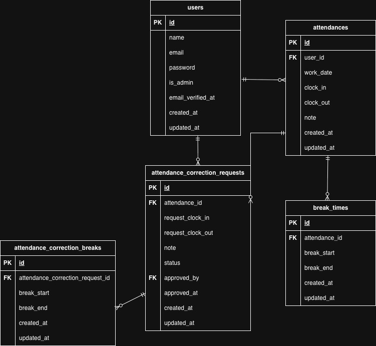

# 勤怠管理アプリ

## 環境構築

Dockerビルド
1. git clone
git@github.com:Estra-Coachtech/laravel-docker-template.git
2. リポジトリ名を変更
mv laravel-docker-template trial_project_2
3. リモートURLを変更
git remote set-url origin git@github.com:kinoppe/trial_project_2.git
4. Dockerコンテナを起動
docker-compose up -d --build

## Laravel 環境構築

1. docker-compose exec php bash
2. composer install
3. cp .env.example .env , 環境変数を適宜変更
DB_HOST=mysql
DB_DATABASE=laravel_db
DB_USERNAME=laravel_user
DB_PASSWORD=laravel_pass
4. php artisan key:generate
5. php artisan migrate
6. php artisan db:seed
7. php artisan storage:link

## メール認証

1. .envのメール設定を適宜変更
MailHogの使用例
```
MAIL_MAILER=smtp
MAIL_HOST=mailhog
MAIL_PORT=1025
MAIL_USERNAME=null
MAIL_PASSWORD=null
MAIL_ENCRYPTION=null
MAIL_FROM_ADDRESS=test@example.com
MAIL_FROM_NAME="${APP_NAME}"
```

## API仕様

* 勤怠一覧取得
GET /api/v1/attendance-records
認証不要
* 勤怠詳細取得
GET /api/v1/attendance-records/{attendanceRecord}
認証不要
* 勤怠新規登録
POST /api/v1/attendance-records
Sanctum認証必須
* 勤怠更新
PUT /api/v1/attendance-records/{attendanceRecord}
Sanctum認証必須、認可必須
* 勤怠削除
DELETE /api/v1/attendance-records/{attendanceRecord}
Sanctum認証必須、認可必須

API認証
* Authorization: Bearer APIトークンを設定
* Accept: application/json
* Content-Type: application/json

## テストケース

全てのテスト実行

php artisan test

特定ファイルを実行する場合はテストファイルパスを指定

php artisan test tests/Feature/Attendance/AttendanceTest.php

## 使用技術

* PHP 8.1.34
* Laravel 8.83.29
* MySQL 8.0.36
* nginx 1.21.1

## ER図



## URL

開発環境
* 会員登録画面（一般ユーザー）：http://localhost/register
* ログイン画面（一般ユーザー）：http://localhost/login
* 出勤登録画面（一般ユーザー）：http://localhost/attendance
* 勤怠一覧画面（一般ユーザー）：http://localhost/attendance/list
* 勤怠詳細画面（一般ユーザー）：http://localhost/attendance/detail/{date}
* 勤怠レポート画面（一般ユーザー）：http://localhost/attendance/report
* 申請一覧画面（一般ユーザー）：http://localhost/attendance/stamp_correction_request/list
* ログイン画面（管理者）：http://localhost/admin/login
* 勤怠一覧画面（管理者）：http://localhost/admin/attendance/list
* 勤怠詳細画面（管理者）：http://localhost/admin/attendance/{date}
* スタッフ一覧画面（管理者）：http://localhost/admin/staff/list
* スタッフ別勤怠一覧画面（管理者）：http://localhost/admin/attendance/staff{id}
* 申請一覧画面（管理者）：http://localhost/attendance/stamp_correction_request/list
* 修正申請承認画面（管理者）：http://localhost//stamp_correction_request/approve/{attendance_correct_request_id}
* phpMyAdmin：http://localhost:8080/

## ログイン情報

php artisan db:seed実行時のダミーデータ

* 一般ユーザー1: メールアドレス / パスワード
user1@example.com / password
* 一般ユーザー2: メールアドレス / パスワード
user2@example.com / password
* 管理者: メールアドレス / パスワード
user3@example.com / password